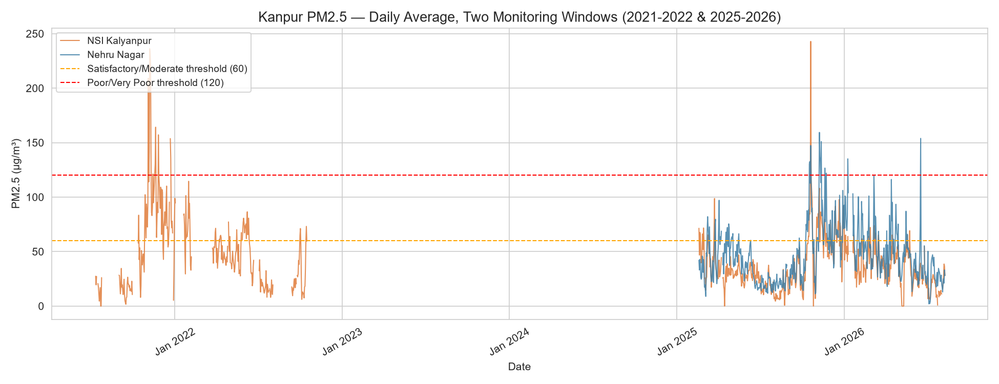
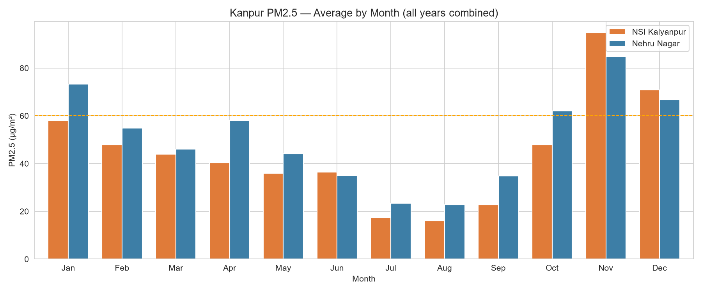
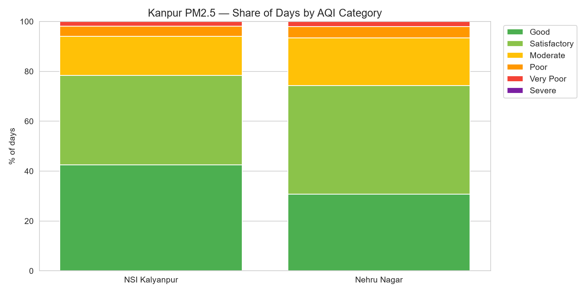
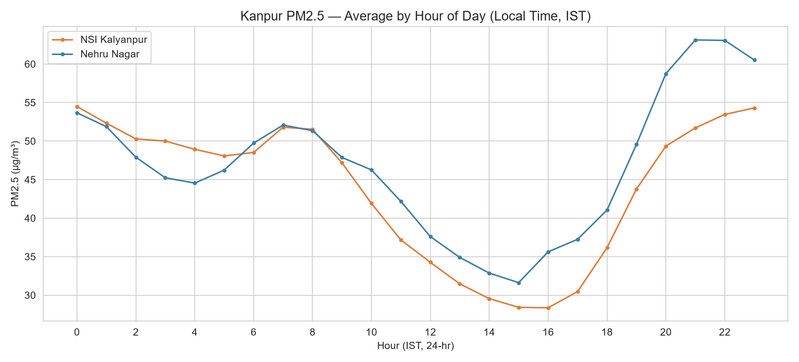
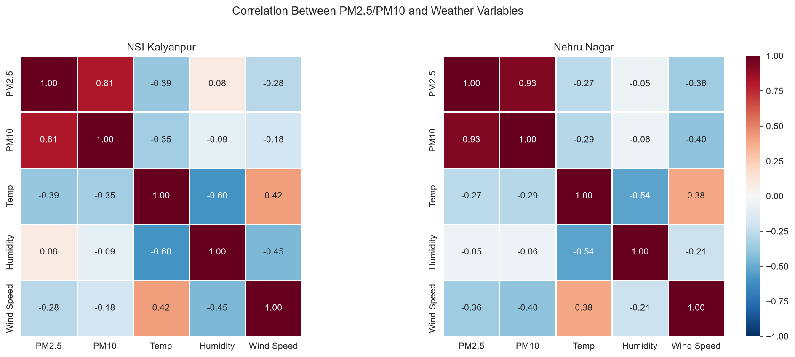
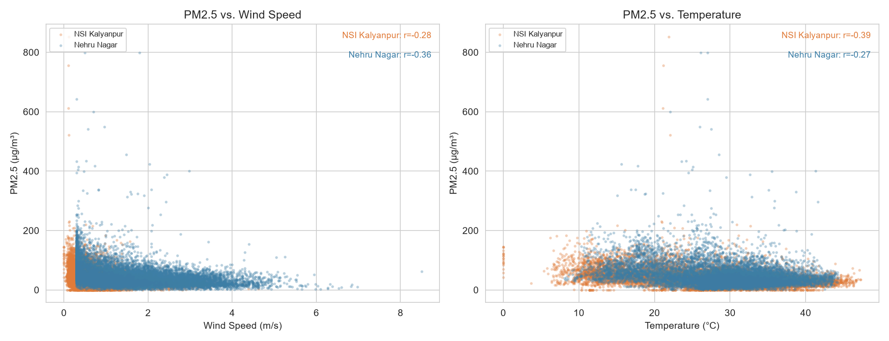
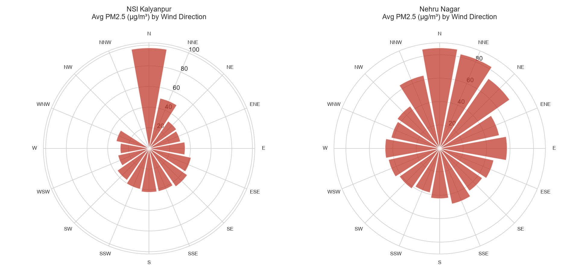

# Kanpur Air Quality Analysis

Analysis of PM2.5/PM10 trends, seasonal patterns, and weather correlations across two Kanpur air quality monitoring stations (NSI Kalyanpur, Nehru Nagar) using real CPCB/UPPCB data via the OpenAQ API and Python.

## Key Findings

- **Seasonal cycle:** November PM2.5 (~90-95 ug/m3) is roughly 5x the August monsoon low (~16-22 ug/m3) at both stations.
- **Daily rhythm:** PM2.5 peaks in the evening (~9-10 PM IST) and is lowest in mid-afternoon (~3-4 PM IST), consistent with traffic timing and the atmospheric boundary layer collapsing after sunset.
- **AQI breakdown:** both stations spent ~6% of monitored days in "Poor" or "Very Poor" AQI territory.
- **Weather correlation:** PM2.5 is negatively correlated with both wind speed (r = -0.28 to -0.36) and temperature (r = -0.27 to -0.39), confirming that wind dispersal and daytime atmospheric mixing both reduce pollution.
- **Wind direction:** both stations independently show their highest average PM2.5 when wind blows from the north - a genuine open question on upwind source vs. seasonal confounding (see full report).

## Charts

## Data Source

Data pulled from the OpenAQ v3 API (https://api.openaq.org), which aggregates CPCB/UPPCB continuous ambient air quality monitoring station data. Two Kanpur stations analyzed: NSI Kalyanpur (ID 229252) and Nehru Nagar (ID 5662).

**Coverage:** two monitoring windows exist due to a real station data gap (~Nov 2022 to Feb 2025): Window 1 (Jul 2021 - Oct 2022) and Window 2 (Feb 2025 - present). Weather variables (temperature, humidity, wind speed/direction) are only available in Window 2.

## Project Structure

Project Structure

fetch_data.py       - Pulls PM2.5/PM10 and weather data from OpenAQ API
01_clean_merge.py   - Cleans and merges PM2.5/PM10 per station
02_analysis.py      - Seasonal, AQI, and diurnal analysis
03_visualize.py     - Generates charts 1-4
04_weather_merge.py - Merges weather variables with pollutant data
05_weather_charts.py- Generates charts 5-7 (correlation, scatter, wind rose)

charts/              - All 7 generated visualizations
data/                - Cleaned, analysis-ready datasets

Kanpur_Air_Quality_Report.md - Full written report with methodology and findings
requirements.txt             - Python dependencies

## Setup and Reproduction

1. Clone this repo and install dependencies:
   pip install -r requirements.txt
2. Get a free API key at explore.openaq.org
3. Create a .env file in the project root with: API_KEY=your_key_here
4. Run the scripts in order:
   python fetch_data.py
   python 01_clean_merge.py
   python 02_analysis.py
   python 03_visualize.py
   python 04_weather_merge.py
   python 05_weather_charts.py

## Full Report

See Kanpur_Air_Quality_Report.md for complete methodology, findings, limitations, and interpretation.

---
Author: Avnish Singh - Civil Engineering, Harcourt Butler Technical University Kanpur (28)
